## 前言：
本来以为这周汇报的 如果是下周的话明天（星期四）上午能不能约老师讨论下（笑） 最近各个方面都刚开始 想法还挺多的
## 目录：
* COMSOL案例体验 初步了解多物理场软件功能（just a joke）
* ETS-SJ代码分析与重构建议
  * 显示架构调整
  * 有关INTESIM Lib的问题
  * Mesh模块
* 未来调整打算及其它问题 
  * GUI页面开发可解耦
  * 关于服务器管理与合作开发
  * 更换IDE（VS-Qtcreator）
  * 求解器整合
  * 专业知识学习路径
* 强化学习领域AI4Science论文调研
## COMSOL案例体验
### 扳手儿
模型导入 界面视觉操作 材料 参数

固体力学操作 网格 研究 结果

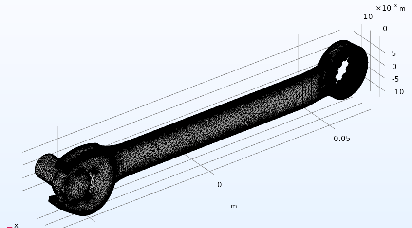

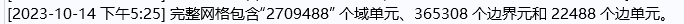

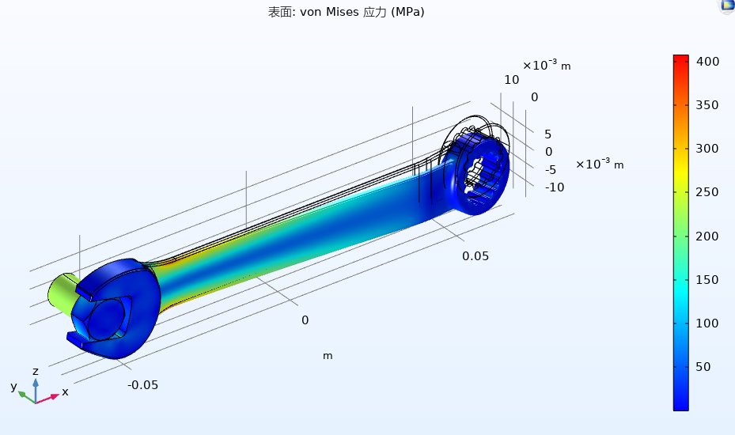

### 母线板-多物理场
焦耳热-电流/热

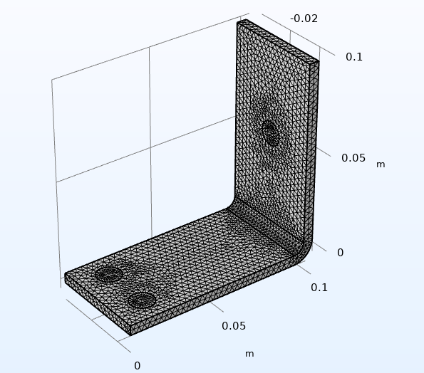

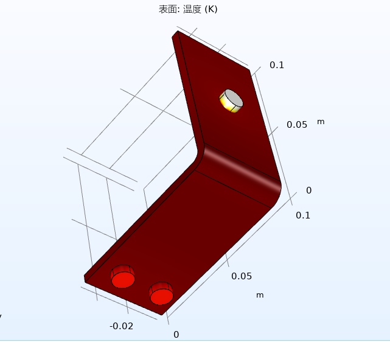

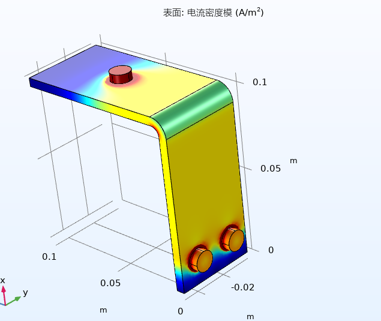

## ETS-SJ
### 架构理解
绝对路径、拼音命名这些就不吐槽了，这一坨东西代码量不小，但是这不是类图很混乱的理由，我简单贴几张他们的类图大家感受感受

（supported by powerDesigner）

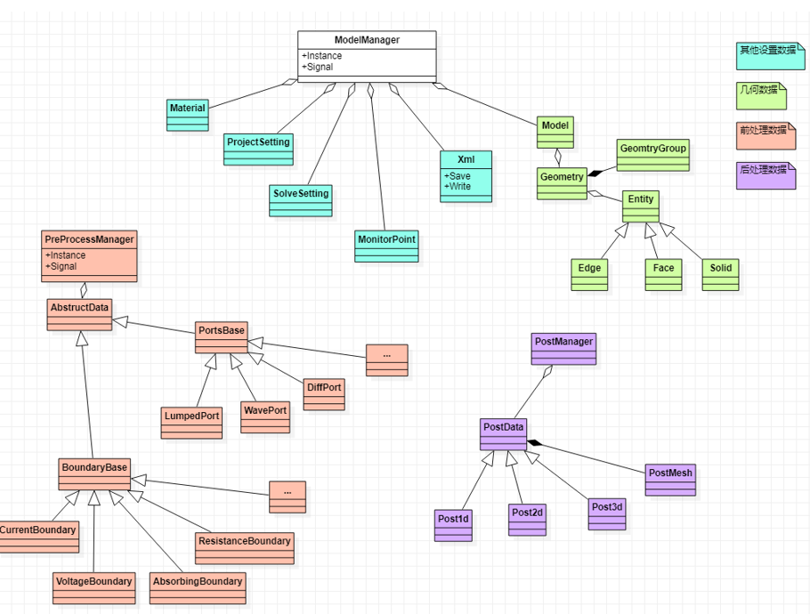

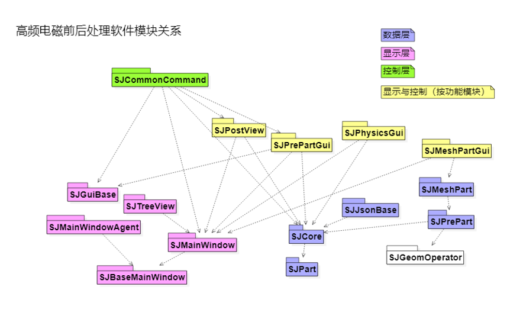

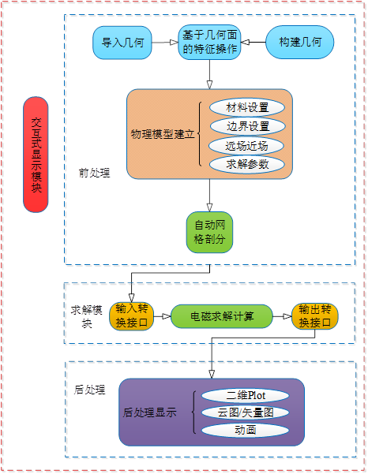

先挑软件实现与理论知识耦合较少的部分开始优化：
### 架构调整准备
#### 显示相关
混乱的最主要原因是所有业务逻辑都使用了INTESIMLib（他们自己的库），而且不知道是不是Lib问题，这些业务逻辑全都和显示掺杂在一起

这里的“显示与控制”最后都要拆开，业务逻辑只提供需要显示的数据，不参与显示逻辑

比如：

MainWindowAgent MainWindow SJBaseMainWindow SJGuiBase变为两层：

界面元素（暂定GuiComponent）+ 界面逻辑（可以沿用MainWindowAgent）

写成这样很可能是因为他们安排了两个人开发这个部分 然后交流不充份

#### INTESIM学习成本
这东西没文档（商业行为不好评价） 所以我也不知道怎么在他们的规则里大改 后面找到瓶颈之后如果我自己重构他们的库里的功能：

* 肯定是能写出来
* 性能估计也确实会更好
* 但是费时费力

#### MeshPart
这个部分是目前来看最需要重构的 原因：
* 完全由INTESIMLib开发
* 与求解直接相关 但是求解是我们自己在写要去调整的

这边需要一些建好的模型来单独测试这个部分的性能
准备先看看只改逻辑剪枝能快多少
### 其它问题及调整打算
#### 关于页面

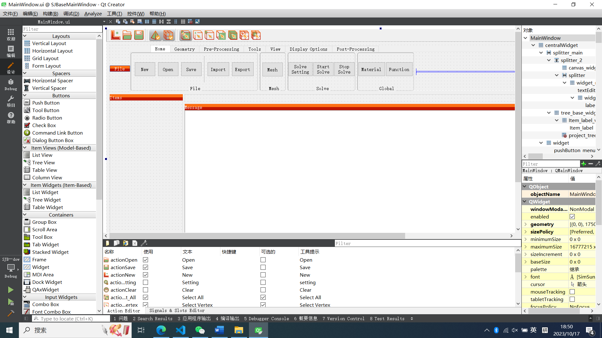

Qt支持图形化Ui开发，自动生成代码

我本来以为这事儿只有不会写代码的小朋友才干 我自己的两个QT项目的UI都是代码搓的（虽然加起来只有3000行）

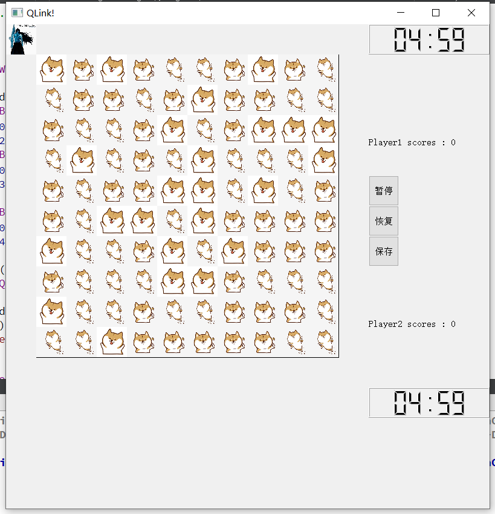

没想到他们是这么干的（小声

所以好消息是这个页面好不好看和它的功能是完全解耦了的 这个部分谁都能干 这也是我坚持想用qt creator的原因之一

坏消息是后期得找个审美比较好的朋友来画画 我反正审美还是挺烂的
#### 关于合作开发：
项目结构还是相当大的，开个github方便版本管理 

但我们肯定不能开源 所以得private repository

问题是github的private就安全吗 其实也不好说
哪天我号被盗了把这种程度的科研成果泄密了就太夸张了

最好的办法是给咱们自己的服务器上搭一套git 这个是绝对安全的 只是稍微麻烦一些

如果有服务器的话 可以我来管理 监控方面普罗米修斯已经很成熟了 给它加个前端就行 SSH也挺熟练的
#### 能不能别惦记这VS了
>不懂为什么写Qt不用Qtcreator(雾) 而且为什么是Qt4.3啊 这软件不是21年开发的吗 我21年写大作业用的版本都比这个高

个人讨厌visual studio这个IDE 打算向Qt creater重构

但是晨飞学长说英特仿真后面要二次开发 他们只用VS

希望沟通下能改变他们的想法
#### 求解器整合
晨飞学长和我解释了这个软件叫“前后处理软件”的原因，因为求解器这部分是我们实验室的特色

但我仍然觉得手动出来运行求解器实在是过分抽象了

有必要整合进软件运行过程之中，后续更新求解器只需要我去配个CI/CD，求解器代码有更新发个pull request就好了
#### 学习路径
我的数理基础还过得去（荣誉课程） 但是都太基础了

得把用到的这几个物理场再学一遍 但我不知道什么学习路径比较合适

球球学长学姐指点
## AI for Science
人不读论文是没办法搞科研的
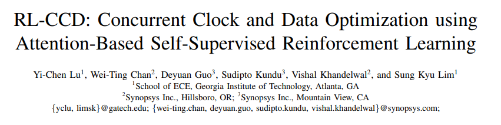

最先选这篇是因为：
* 我之前是做RL的 具体来说是做offline model-based的goal-conditioned sparse reward之后可以的话当然也是想继续做RL的
* DAC好像是EDA的会议里唯一一篇CCF-A 我对期刊不了解

### Abstract

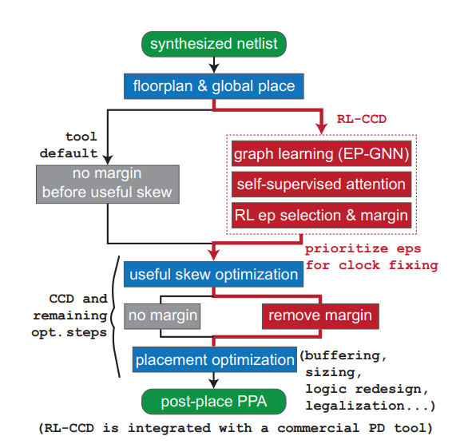

很细 RL只用在了选violating endpoints上 其它的部分还是尊重了CCD本来的成果 但我没接触过CCD，估计也许以后也不会接触CCD。

主要是关注为什么选endpoint要用RL，原文里讲的很确切了：

>RL thus becomes a promising solution as it does
not require any labeled data and has been demonstrated to achieve never-seen, high-quality optimization results in many fields

### Think about it
这几年AI for Sciense搞的火热 杨小康老师在张江那个会我还被抓去听了 听下来觉得有的领域里的确是直接力大砖飞就完事了 什么约束都不加的 

但目前看下来EDA里做AI还是要尊重一下基本规律

这也和我的预期大致相符 面对一个解析解找不到或者找到了也没用的问题时（湍流、蛋白质折叠结构预测、symbolic regression...）不如试试AI，尤其是不如试试强化学习，万一能行不就赚大了。

之前组里有且仅有一个20级同学在做symbolic regression，他的model已经知道什么是三角函数了（知道的标准大概是那些三角函数的初等变换比我们俩算的还快），这个是他的prp，当时做出来我也乐了半天，虽然这和我一点关系也没有（笑）。

这里贴一篇我觉得非常好地描述了AI4S中AI到底起了什么样的作用的博客作为结尾叭

https://www.zhihu.com/question/547902474
