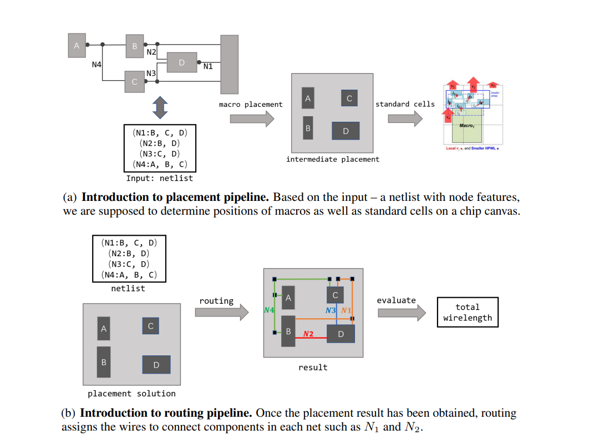
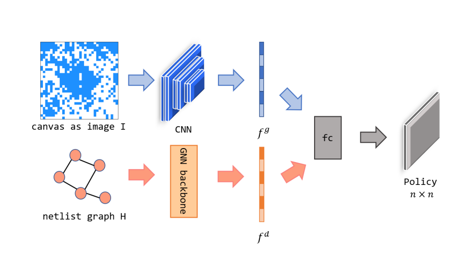
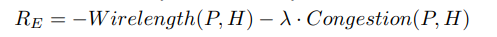
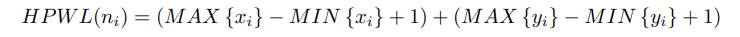
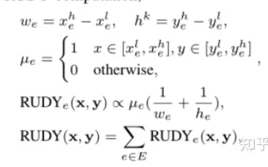
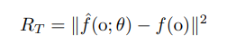
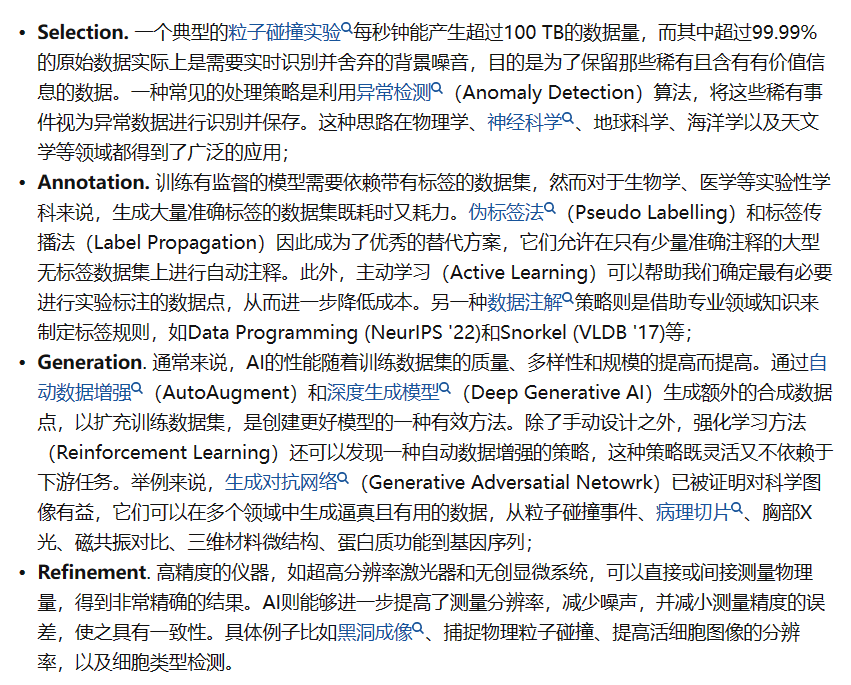
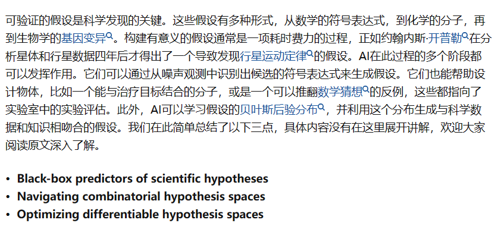
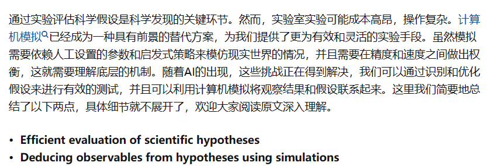
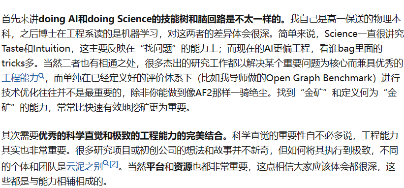

## SPATIAL ACIS && HOOPS
建模的

ACIS：核心支持

HOOPS：交互应用

没找到资源 盗版抓的严？

## AI for Science
人不读论文是没办法搞科研的

选这篇是因为：

* 认识严骏驰老师 AI研究院呆过的少见有人不认识严老师（笑）

* 

* 原来EDA能发NIPS的
### Abstract
强化学习做布局管理需要解决：
* 可扩展性
* reward function设计
* end-to-end learning

#### 布局问题：强化学习 DeepPlace
policy iteration 这里作者用了PPO

输入网表（H=（V,E） 节点表示元件 边表示线） 

期待得到绕线长度更短和拥塞更少的布局

之后引入布线问题进入DeepPR部分 把线总长作为两个任务的reward

#### network design

#### reward function

P:placement solution

H:netlist

线越短 拥塞越少越好

拥塞那部分用的是RUDY

解决Sparse reward：random network distillation

简单来说就是另外维护一个随机初始化的网络 当前的agent行动后加上这样一个reward来鼓励它的探索

### Think about it
这篇工作是21年的 那会儿深度强化学习还是个新鲜玩意儿 工作确实挺出色 但估计放到现在是中不了NIPS的

这篇里能学到的主要是它的问题形式化方法（canvas直接当成图片输入；网表处理成GNN）和一些训练时候的trick（RND）

以及RL的优势可能反而在于：

很多时候我们允许放一个超参在这里慢慢调 作者无法给出任何形式化的证明来说明布局和布线哪个对最终的结果影响更大 那就放个超参调咯

### 王瀚宸-What can AI do for Science

2014-2018 南大物理 本科
2018-2022 剑桥ML PHD 
2023-2026 Stanford&Genentech 
#### AI-aided data collection and curation for scientific research

那群做推荐系统冷启动的很喜欢这么干 但是这事儿好像没见有人在EDA里做

因为他们有需要的适用场合（新用户注册马上把它抓住）

#### AI-based generation of scientific hypotheses

symbolic regression

那群人做梦都想在一些没有解析解的地方猜出点公式 不展开说了 做出来了就是Nature Science级别的成果

#### AI-driven experimentation and simulation

这事儿就真的只有理科在做了 我有个朋友致远化学的 做计算化学的 拿到了X-lance的直博offer 但是没去（笑）

#### something unpleasant to say

