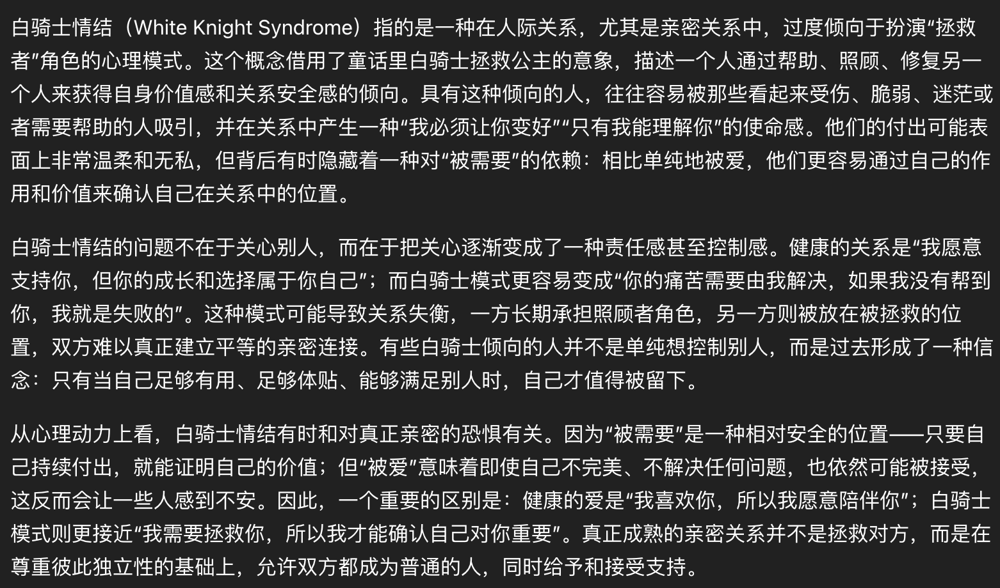

## 海
您诸位好啊。

上一次写年终总结还是2022年。这个博客也快要两年没有更新过了。

为什么中间两年没写呢，因为这次提到的很多故事并不开始在2025年，但都在2025年结束，或者有了里程碑结果。

就像《没离开过》说的那样，这几年逆水行舟，这些事情在我左右推着我走，到行笔的时候终于露出水面喘了口气。

由于时间跨度太长，而且我的记忆也已经变得模糊，这次的年终总结不会按时间顺序来写，而是会在三个不同的维度讲一系列我身上发生的故事。

第一个部分讲钱和钱带给我的变化，第二个部分讲我和其他人相处的过程中一些值得记录或者纪念的体验，第三个部分讲我对自己的一些新的认识。

## 自己

## White Knight
以防有人不知道，white knight 情结指的是：

我从2022年开始深受其害，遇人不淑开始了一段一般人在小说里都不一定写的出来的，超级不健康的关系。

这段关系导致我的睡眠质量断崖式下降，严重损害了我的社会功能。我实在不想在这里去描述非常不夸张地说，我的微信被删了三次。

在漫长的时间之后，一直到2025年我的大部分人生课题柳暗花明后，这段灾难性的关系依然横亘在我的心里，它对我的影响已经很小了，但我很难接受它的存在，于是我发了一篇长长的小作文结束了联系。

## 采访
前情提要
采访收获
后续

## 科研
三月开始做正式+对接，换方向，五月份确定问题解决

做具身，出差

极限速通ICML

极限速通NIPS

第一篇一作打磨完成

## 搬家
巨大的空洞得到填补，有了落脚之处
有了一个泉水，而不是一直扣血的debuff
