## Just deliver something

在2023年3月到5月这段时间我进行过一些subgoal-based RL的研究和尝试，比较遗憾没有什么结果。

老板推荐，偶然发现了这位来自UC伯克利的小日子老师做了很多subgoal的工作。

这我不得抱起来狠狠拜读！

## Abstract
如果能给subgoal组织成良好的结构，先找近的，一步一步往远走就容易一些

组织方式和director很像 一层manager一层worker。

manager从state得到latent representation作为subgoal，worker实现subgoal

特殊的地方在于这个产生了manager和worker的value function不含action

* https://seohong.me/projects/hiql/

## Introduction
offline go-conditioned RL问题：
* （state, goal）-> value function学不出来
* offline数据源太多，合并进入传统RL方法有困难

说了一个可能导致sparse reward难学的原因
当goal很远时，好的策略和不好的策略几乎看不出区别，因为任何错误都可以在之后的过程中得到修正（理论上），这就导致非常难学到一个从头到尾都正确的action series

解决办法跟director类似
* IQL从offline buffer里学一个policy
* 一个policy变俩，manager+worker

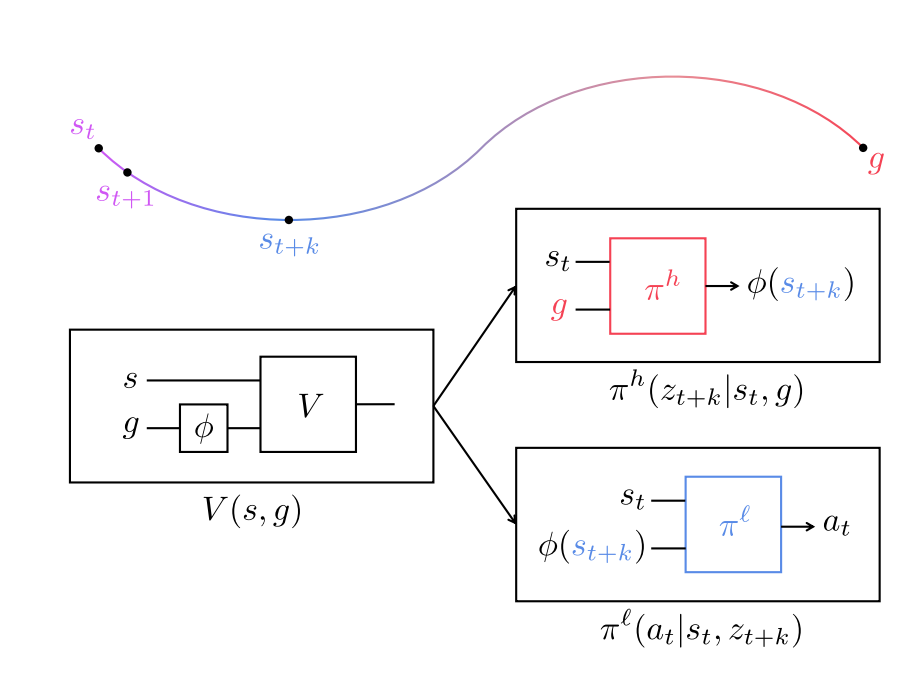

g:final reward

s:state

z:subgoal

a:action

k:每k步一个subgoal

IQL:V(s,g)

manager:s,g->z

worker:s,z->a

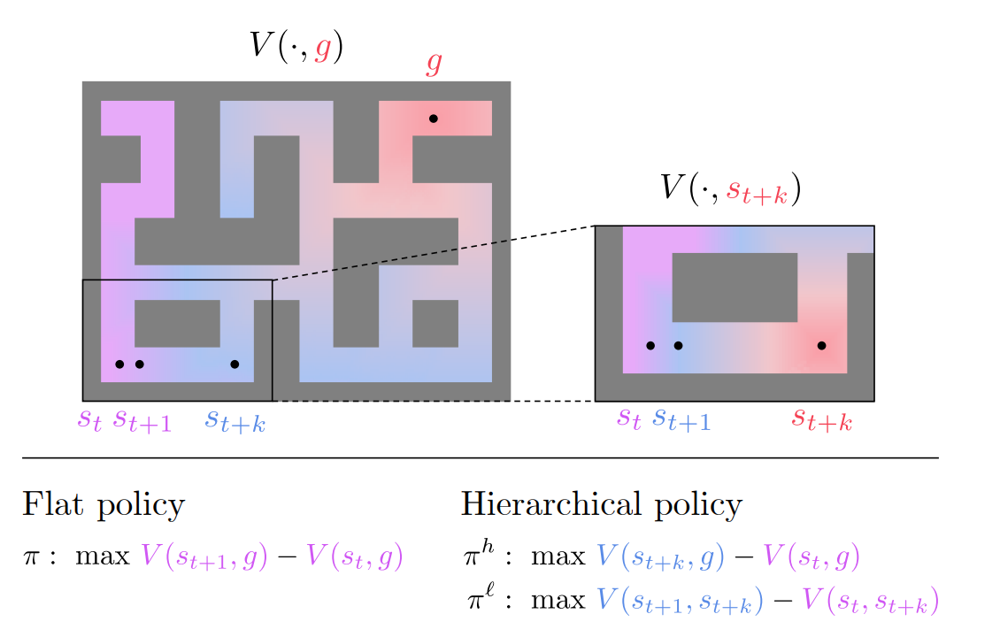

虽然不是同一个policy，但是同一个value function，可能会不好学

所以虽然同一个value function，但是不是同一个policy，fine-tune了一下

manager需要学的是怎么每K步做一个subgoal

worker需要学的是怎么到达眼前这个subgoal

亮点是IQL和manager不关心action，所以能应对offline的大量数据
而且不需要experts trajectories

## Preliminaries
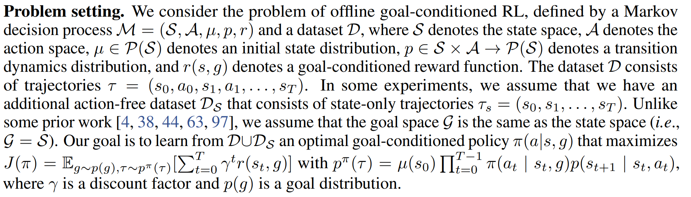

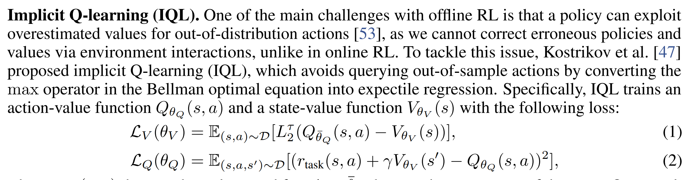

IQL是他们组2022年一篇ICLR poster的工作：论文里讲的挺细，最后的结论是IQL和一般的Q-learning比，不需要那么关注action，但是我确实看不懂他这个Loss哪来的。

于是决定去知乎，文化先跟初中生同步一下

* OfflineRL本来的Loss：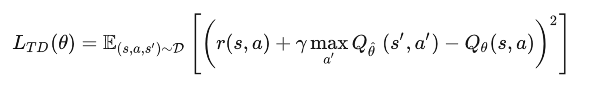 取让s最接近s'的action的Q过来。问题是定义域外的action也能算出一个Q，把这个Loss搞废了
* 改进的Loss：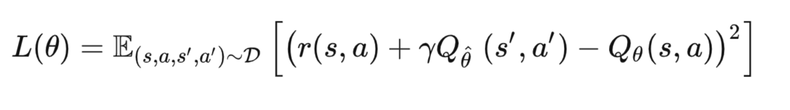不取最大，不做query，因此定义域外的action不会参与loss计算
* 引入调参手段：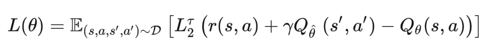
* 把s'的Q分成两个值函数构造：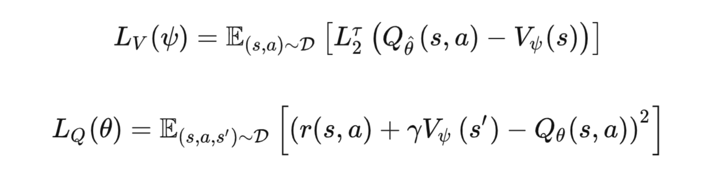

* 最后把Qlearning拿走，放弃学习action与state之间的关系，就得到了HIQL这篇里的东西啦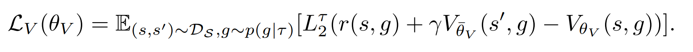 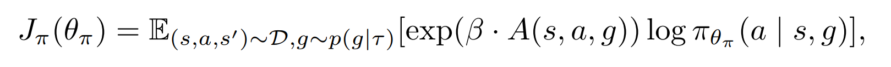 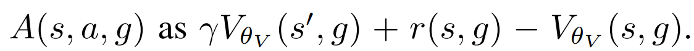

## Hierarchical policy structure
### 作者眼中sparse reward困难的原因：信噪比

* final reward很远的时候，不同的state之间输出的value差别会很小 这导致一些错误的action是可以得到纠正的 所以很难分辨action的质量
* 更糟糕的是，在难以分辨的有效值以外充满大量的噪声
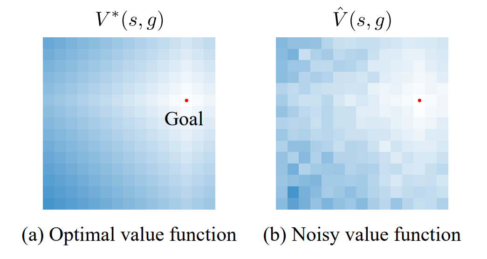

### hierarchical policy structure
重复描述Introduction中对应的这一部分

### toy环境上的理论证明
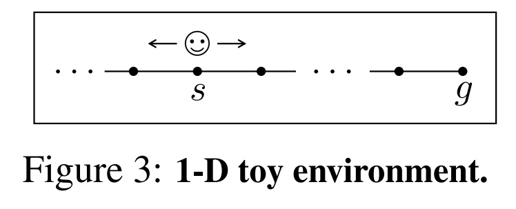
这个环境下Value function就是单纯的-|s-g|
* 因为状态转移概率是1所以没有期望 因为只有一维所以不需要累加/累乘
这个环境下，subgoal被人为控制的越来越远
那么如果我们不做subgoal，考虑的范围就只有左右两格。每K步做一次subgoal 考虑的范围就是左右K格（笑）

这里作者附录里给出了理论证明：
* 找到了在有subgoal情况下，这个toy环境中决策错误概率的理论上界
* 证明了他们方法的manager和worker犯错概率都要比flat策略更低

如果我刚学完概统我肯定能把这段看懂，可惜已经过去快两年了（笑）

## Method：Hierarchical Implicit Q-learning
非常简短。。。
### 策略一分为二
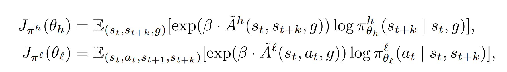
上面那个是manager学怎么产生subgoal

下面那个是worker学怎么接近下一个subgoal

A其实就是前后两个Value function的差 具体怎么减在Introduction的这一部分里介绍过了

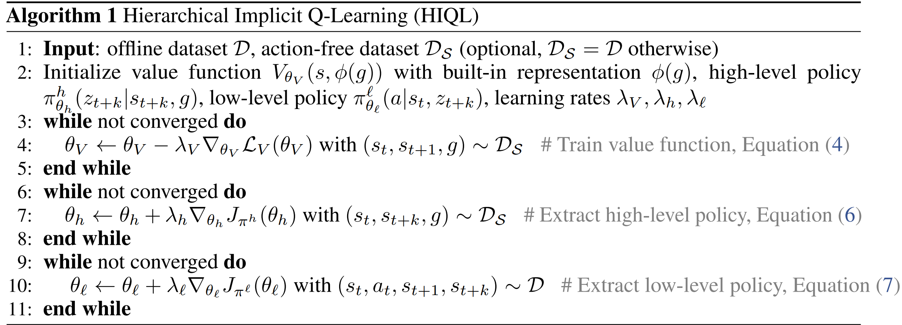

训练完value function之后分出manager和worker两个policy

### subgoal的表征方式
直接用state的一部分当subgoal
