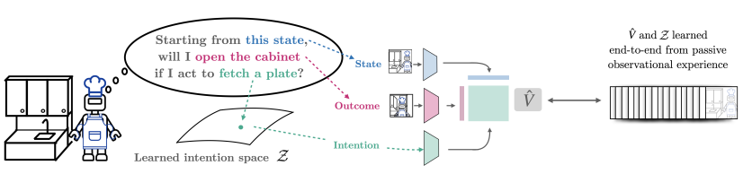
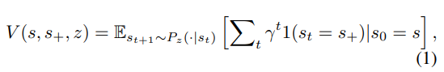
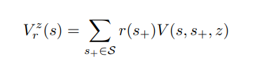
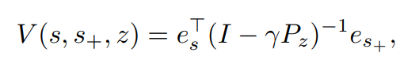
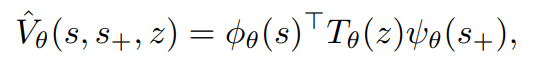
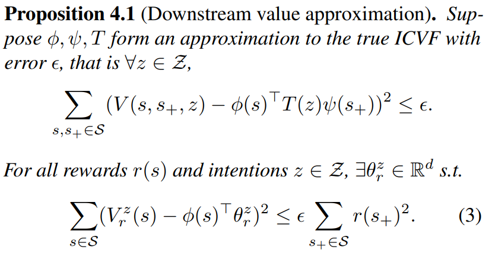
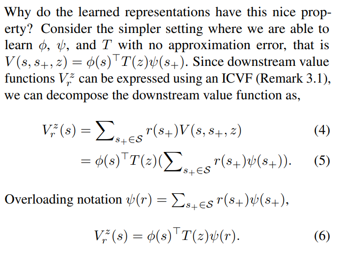
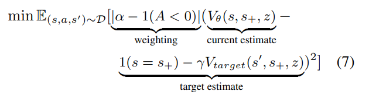

## Abstract
大多数真实视频对RL来说都比较难办 因为不知道怎么定义value function和action label

这些被称为passive data 被动可能被动在无法落入现成的评价体系里

这里提出model intentions：猜下一步action后变化情况的概率分布。

>"How likely am I to see __ if I act to do __ from this state"

和dreamer有点像属于是

* https://github.com/dibyaghosh/icvf_release

## Introduction
非常耐心地讲了一下RL为什么难以处理真实数据 因为缺乏好用的评价指标

这篇工作引入了intension space Z,以此作为value function的主要参考。

agent在环境中怎么互动和怎么探索有轮子，工作主要集中在：
* 预测
* 完成latent space训练后，这些intension数据在action中的使用情况

这个老师比较诙谐

图比较好理解，latent space的内容是“对未来假设进行一些动作会发生的情况的预测”，拿这个和st st+1凑一个value function。
## Formulation
马尔可夫链 没啥新鲜东西

## Method：RL using passive Data
### ICVF intension-conditioned value function
传统的RL学一个Q function state-action对
我们学一个Z function，用intension代替state,用outcome代替action

以前是状态随着action改变 现在是猜一个intension，拿一个outcome检验，再猜下一个

那这个和dreamer相差非常大了（笑）

他这里可以把各种任务的reward做个期望分布

这样可以让基于intension的value function和具体的任务解耦 所以他说这个预训练方法适用于所有任务

### learning representations from ICVF
这个Value function黑盒的 怎么说明它对接下来的RL任务起到了多少作用呢？

* 转化成的state representation必须能比较容易的从model里得到
* 面对一个具体的task，这个state representation必须对具体的reward有用

先做个数学处理 把value function改成向量形式

这是个线性无关的 三个向量分别代表着state（es） ，过了一层intension后的state（中间那一坨 这是1993年一个工作的表示方式）以及实际的最后的state（es+）

所以我们学三个网络来表征value function

现在就满足了我们的这两个需求：
* 好表示 这都解耦了当然好表示
* 有用 他说他们证明了当任务确定下来的时候，他们的representation线性接近任何一个具体的task

没看懂（笑）

### learning ICVF from passive data
最后一块拼图

证明了ICVF有用和怎么用之后 问题就是ICVF怎么来了

这里只是提出了一种task情境下的passive data-ICVF 是一个multi-linear 多重线性

很无聊 就是从（st,at,st+1）的buffer里拿一堆数据丢进这个所谓的ICVF

### 实验
明天补上（笑） 他们自己搭了环境 不是传统的offline环境 还挺有趣的