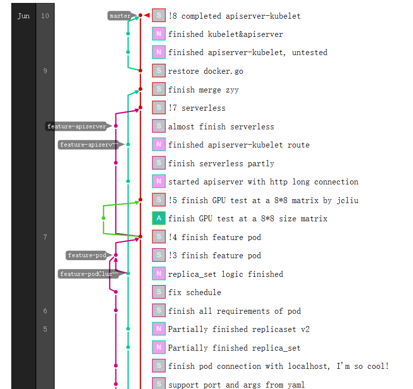

# Sikongdddl的文档

## 环境相关

### python

### go

### 项目相关
github repo地址：

https://github.com/Sikongdddl/SparkPlugin16

“项目管理风格”加分点：

> 晨会

每天开个15min小会 每个人介绍一下以下内容：

* 昨天做了什么
* 今天要做什么
* 昨天遇到了什么问题自己有点难解决

做好会议记录 其实一共也就五天的时间 五场会 而且因为大家白天都在一起 这就是纯纯的形式主义

> github repo

每个feature开一个branch 

具体来说：前端单独一个branch；后端单独一个branch；调prompt的json和yaml单独一个branch
自己负责的任务基本完成可以提交后，向我们的主分支发送一个pull request 审批后并入主分支
这样我们的开发过程就会有一个类似这样的图：

十分滴好看，当然这一切要建立在他们允许我们建立仓库的情况下

> 文档

我们这个文档本身就是个很大的加分点
后面最好还是大家都来参与一些编写工作 记录一下自己的开发日志之类的
### 分工
陆朋朋 雷逸 前端网站开发
宫俊儒 后端开发+推荐系统工作准备
宋奕辰 刘非凡 董雨康 调prompt
### 推荐技术

#### 这个博客是怎么来的
参考帖子：https://blog.electronicwaste.cn/
技术栈为hugo+githubpage 挺流畅的 我当时折腾了两天就搭起来了 大约花了六七个小时的时间
程序员的职业生涯是从拥有自己的博客开始的（笑）
### 其他一些有的没的

### airport list

这个事儿要冒着被墙或者喝茶的风险 

因为自己翻墙是违法行为，但是不违反刑法。但传播扩散机场的性质和自己翻墙不一样，可以判煽动颠覆，3-7年。

大家觉得自己机场不太稳定/有点贵可以来问我要一个两年90块的机场地址（笑）