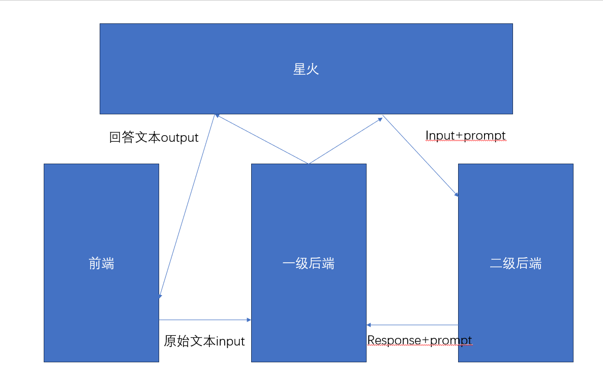

# Sikongdddl的文档

## 环境相关

### python

### go

## 项目相关
github repo地址：

https://github.com/Sikongdddl/SparkPlugin16

### 架构

> 前端：

输入：用户纯文本输入 原始问题input

输出：经过整个系统后最终的输出 response+prompt

工作内容:把input送给一级后端

> 一级后端：

输入：来自前端的用户原始问题input

输出：经过代码润色过的input+prompt

工作内容：

任务一：

简易版：

二级后端只有一个插件API，把润色过的input+prompt直接发给二级后端；

复杂版：做分词提取+选择插件API工作 并把input+prompt发送给二级后端中对应的插件API

任务二：

从二级后端收到response后 润色生成response+prompt 输入给星火大模型生成回答

> 二级后端：

输入：来自一级后端的input+prompt

输出：根据输入信息进行对应内容输出 生成response（json格式）

工作内容：

把生成的json丢给一级后端

### “项目管理风格”加分点：

> 晨会

每天开个15min小会 每个人介绍一下以下内容：

* 昨天做了什么
* 今天要做什么
* 昨天遇到了什么问题自己有点难解决

做好会议记录 其实一共也就五天的时间 五场会

#### 20230820开发记录
雷逸 陆朋朋：前端Vue页面搭建完成

董雨康 宋奕辰 刘非凡：第一后端打通天气API中 从命令行输入问题，根据关键词选择API 生成可以提问的json问星火大模型 已经调通

宋：从高德API获得json

刘非凡：把json润色后返回星火大模型 让大模型返回文本语言

董：整合代码 插件落槽部分

宫俊儒：第二后端完成天气API和星火大模型API需要的json格式化工作和相关接口准备

#### 20230821开发记录
宫俊儒：“藏头诗”prompt调试 准备去开发前端

刘非凡：食谱API后端独立单元开发完成 正在往框架里整合

董雨康：LAVIS图片->文字描述->星火->得到菜名和制作步骤

宋奕辰：rebuttal很快就能搞定 写诗的

雷逸 陆朋朋：页面事件基本完成 渲染还没做

#### 20230822开发记录

宫俊儒：前端+前后端通信 明天预计做一下部署

宋奕辰：后端整合完善 图片接口功能完备 角色扮演prompt翻译导游讲故事

> github repo

每个feature开一个branch 

具体来说：前端单独一个branch；后端单独一个branch；调prompt的json和yaml单独一个branch
自己负责的任务基本完成可以提交后，向我们的主分支发送一个pull request 审批后并入主分支
这样我们的开发过程就会有一个类似这样的图：

十分滴好看

> 文档

我们这个文档本身就是个很大的加分点
后面最好还是大家都来参与一些编写工作 记录一下自己的开发日志之类的
### 分工

陆朋朋 雷逸 前端网站开发

宫俊儒 二级后端开发 架构 

宋奕辰 刘非凡 董雨康 一级后端开发（天气插件开发）

宋奕辰 宫俊儒 Rebuttal插件开发

刘非凡 董雨康 食谱插件开发

### 推荐技术

### 其他一些有的没的

### airport list

这个事儿要冒着被墙或者喝茶的风险 

因为自己翻墙是违法行为，但是不违反刑法。但传播扩散机场的性质和自己翻墙不一样，可以判煽动颠覆，3-7年。

大家觉得自己机场不太稳定/有点贵可以来问我要一个两年90块的机场地址（笑）

1->第三组	86.75

2->十五组	86.25

3->十二组	85.75

4->第二组	84.5

5->第八组	83.5

6->第十组	82.5

7->十三组	81.75

8->第五组	81.5

9->第四组	81

10->十一组	81

11->十六组	80.5

12->第七组	80.25

13->第六组	78.75

14->第一组	75.5

15->十四组	75.25

16->第九组	75