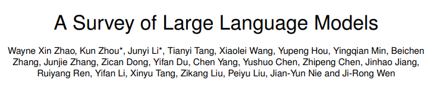
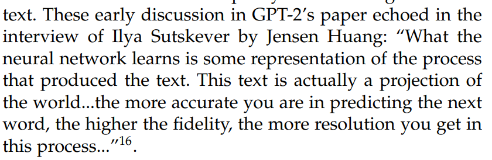

## OVERVIEW
### background
#### scaling laws

#### emergent abilities
* in-context learning without gradient update
* instruction following after fine-tuning
* step-by-step reasoning for deriving the final answer

#### key techniques for llms
* scaling(力大砖飞)
* training tricks
* ability eliciting
* alignment tuning(align with human values)
* tools manipulation(调用工具解决非文本场景)

### technical evolution of GPT-series
#### Early Explorations
引入transformer的GPT1（2017）
generative, decoder-only tranformer, pretrain+fine-tune 核心架构在这个时候就确定了

GPT2 参数量来到1.5B 对于multi-task引入了概率形式表征（p(output|input, task)） 用word prediction解决问题

#### Capacity Leap
GPT2的表现是不如SotA的，但已经被广泛用在了dialog任务中。基于GPT2的GPT3随后诞生。

2020年，GPT3给全世界上了一课，scaling到175B后，他敢于声称自己实现了ICL（in-context learning）。此时NLP的任务已经被GPT3拿下，许多reasoning和domainadaptation的任务也被拿下。

#### Capacity Enhancement
在GPT3的基础上，openAI继续了两方面的工作：training on code data(用代码数据集代替一部分自然语言，这产生了GPT3.5)和human alignment(跟人交互的强化学习 RLHF，这产生了InstructGPT)。

#### Milestones of LLM
* ChatGPT:RLHF+code data (based on GPT3.5 and GPT4)
* GPT-4:multi-model signals， stronger and more safely
* GPT-4V, GPT-4 turbo and so on...

## Resources of llms

