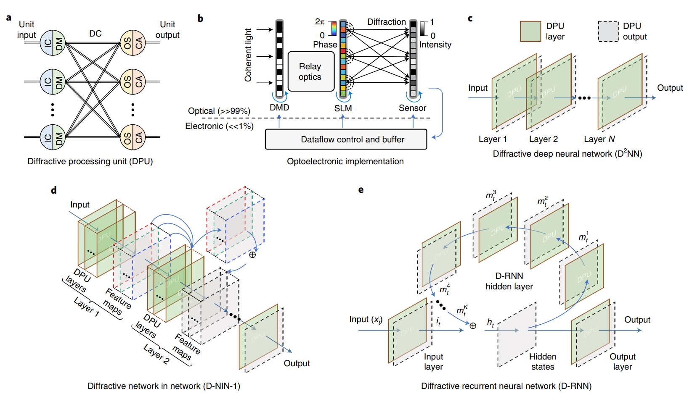
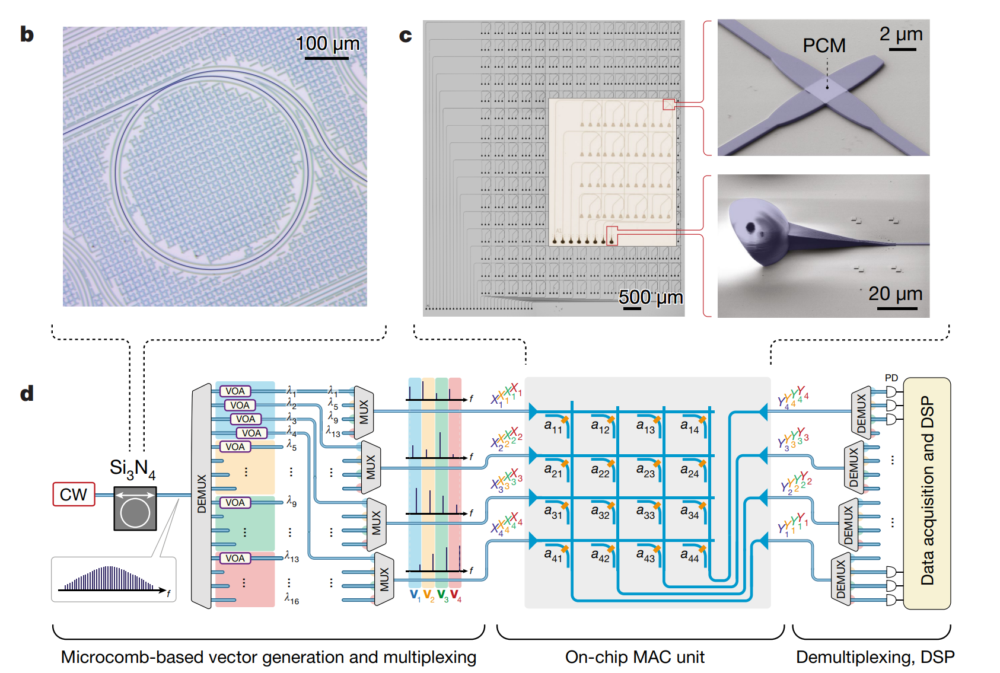
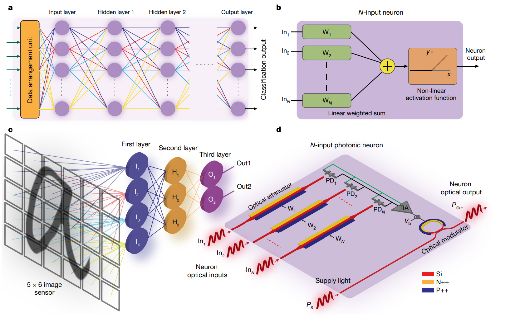
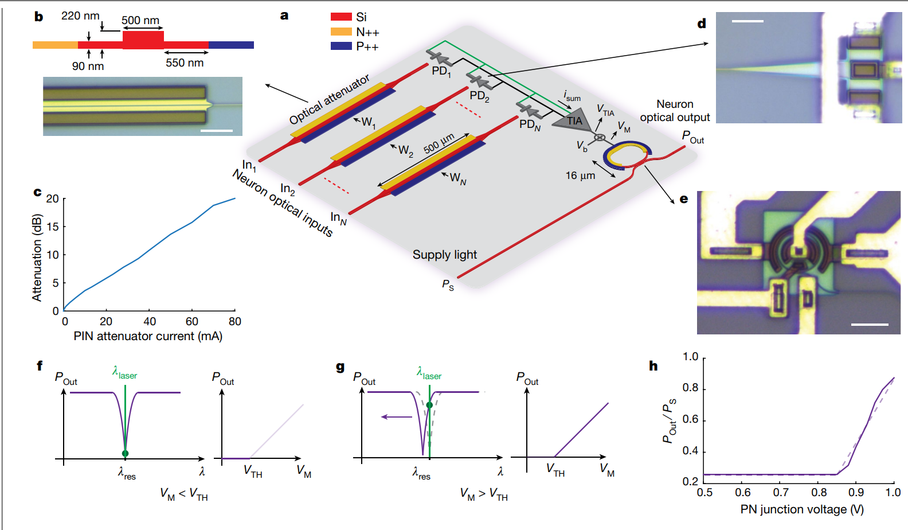
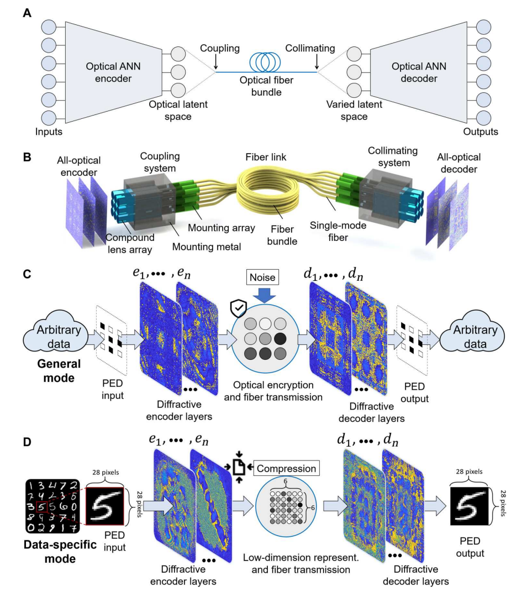
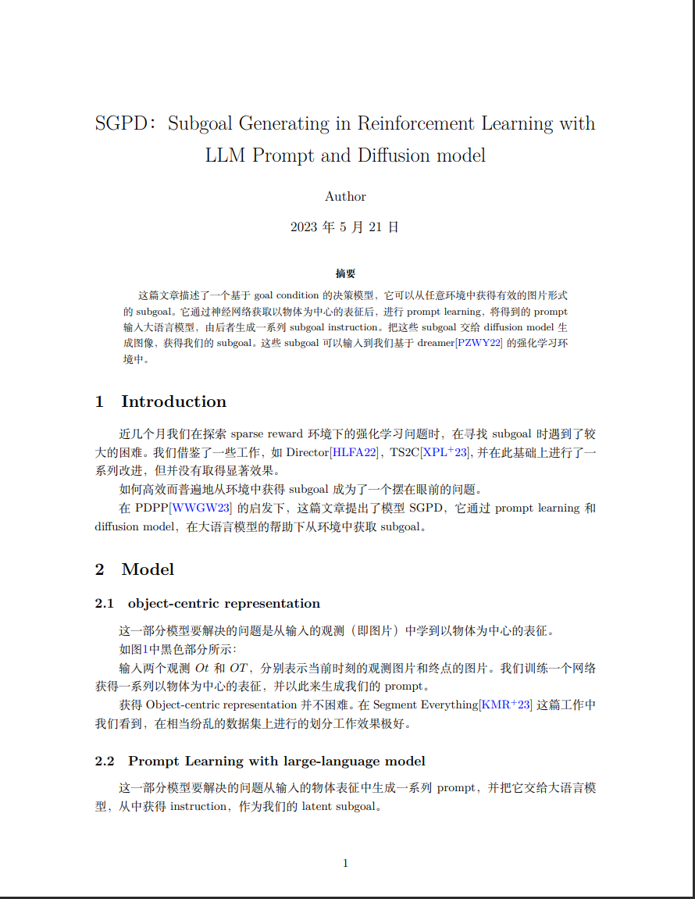
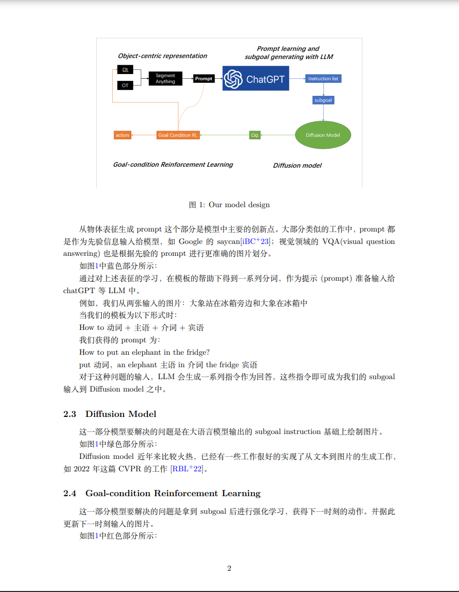
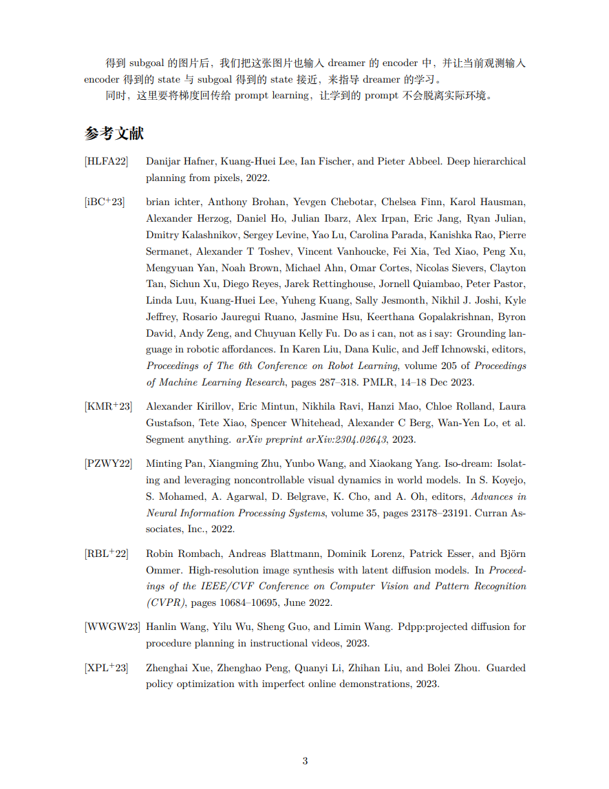

## 对光电计算领域的认识
读到的这四篇工作各有千秋 实验部分没有仔细看 因为一方面这已经是很顶级的工作了，另一方面只要效果出来不输给传统方法，就是行得通的

其中三篇是用光电的手段实现了一些传统方式的模型结构或算法：经典深度神经网络，卷积和VAE。另一篇是在光电的可扩展性方面做出了一些尝试，用基础元件的堆叠来实现“可编程”的光电模型。

光电计算要做的事情是在硬件层面使用光学技术（衍射等）来实现电子元件支持的算符和操作，从而让依赖电子元件的算法摆脱电子元件性能瓶颈。例如宾夕法尼亚大学的那篇工作，用部分光学元件实现了一个做图片分类的神经网络，处理一张图片的速度竟然是0.57ns，这是任何运行在计算机上的程序都无法做到的，因为0.57ns只相当于一个2GHZ的CPU的一个时钟周期。

paper里看到一段话很贴切：

> Optical computing uses photons instead of electrons for computation, and this process can overcome the inherent limitations of electronics and improve the energy efficiency, processing speed and computational throughput by orders of magnitude.

这是一个技术上已经比较成熟的领域，和纯电子计算相比，光电计算有一些非常显著的优势：（当然这完全是两个领域，对比没有太大意义，但也因为完全是两个领域，才能取得难以想象的突破）

* 速度极快 这是由于传输信息的底层方式不同
* 更适合处理光学信息（如处理光纤中的数据）
* 单元体积极小

它也有一些比较明显的劣势：
* 可扩展性非常差 以前总开玩笑说代码改不了，焊死了，这回是真焊死了。调整模型在光电元件上十分困难 也许需要重新做一张芯片。其中一篇增加可扩展性的工作思路是使用基本元件进行堆叠和编程，但这种基本元件的量产难度也依然存在。我们也许很难像蚀刻芯片那样来批量化的制造光电元件，这可能让许多算力的解放只能发生在实验室中，发生在某一个细致的领域内，通用的光电计算机好像已经诞生（金贤敏老师的工作），但普及仍然有很大距离。
* 开发调试成本。做硬件肯定比写代码要更加困难。正如那个著名的笑话所讲，硬件工程师的耗材可以堆满一间实验室，而软件工程师的耗材在自动售货机中就可以全部找到。

这个领域内评价一篇工作好坏的指标大概有以下三个：

* 实现效果 用光电实现的对应技术的效果至少要对标传统方式实现的技术 能超越就更棒了
* 速度 这个一般是远远超过传统方法的
* 可扩展性 这个应该是最重要的

总的来说这是个让我感到振奋的研究领域，也有可能是读的这几篇都是nature science级别的工作，这些工作肯定很让人振奋（笑）
## 潜在的可以开展的方向
### 大模型
说实话我第一篇（宾夕法尼亚大学做DNN那篇）读到一半，大概意识到这个领域想做什么后，第一反应就是transformer能不能用这种形式创造出来，哪怕量产的时间和经济成本再高，我也觉得这是件有意义的事情。

因为GPT系的大模型就是decoder-only的transformer的堆叠，传统方式训练它消耗的人力和物力已经是天文数字了。也许是因为对领域的了解依然不足，我现在读完之后依然觉得如果光电可以做出transformer元件，像reconfigurable DPU那样去堆叠它来进行大模型的训练是一件有意义的事。

VAE能做，卷积能做，甚至RNN都能做出个类似的，transformer应该也能做吧。
如果能解决单个元件的量产和元件之间的通信，以及中间权重的存储这三个问题，那也许用光电实现的大模型落地就只是时间问题了。我不信他比现在的大模型更贵（

也许任何一个科研人员都不希望看到某个领域最优秀的成果像NLP的大模型这样，沦为一个要投入巨大的人力物力才有收益的怪物。

### 可扩展性
读到一些光电或者纯光学的硬件实现的深度学习概念让我哭笑不得 因为我从软件的角度出发思考这个问题得到的答案和实际的解决办法相去甚远。

可编程本身是一个很珍贵的属性。我可以在集成开发环境里实现各种各样的天马行空的想法，但它的前提条件是硬件支持已经到位了。因此在硬件层面做改变时，很多我这种做软件的人完全想象不到的困难就会产生。

我记得有篇工作详细的解释了，怎么利用材料的跳变做出了一个以电压作为自变量的Relu函数，这让我很受打击。因为这意味着前几年那些面向深度学习模型的炼丹操作完全无法在光电这边实现，连一个Relu都这么难做，调整模型的成本绝对不是放在几张显卡上跑几个小时那么简单。

我难以想象这个领域工作的可扩展性会以什么样的方式提升，开发出一种基本元件（像DPU那种）并把它进行堆叠来实现编程也许是一个好主意，但自由度依然没有真正的编程那么高。我期待光电领域的汇编语言或高级语言出现。

当然，像可扩展性这种软件层面的提升都要随着硬件的改变而改变。当年的汇编程序员是比谁代码写的更短的，而不是比谁代码写得更好。如果存储资源一直十分昂贵的话，高级语言或许都不会诞生。
## 相关知识储备

硬件也分传统的电子硬件和光学硬件，我对电子硬件多少还有些了解，对光学硬件就基本没有接触过了。

>软件方面

在交大软工这边造了三年轮子，让我有足够的对新技术的热情和学习能力，支持我在较短时间内学会一门新的开发语言或技术。很多课程需要的知识都是以前没有接触过，但在同时忙很多事的情况下，一个学期内掌握并出活的。

做过一些大模型结合强化学习的工作，相关proposal会贴在最后。在科大讯飞出差期间写过面向大模型的插件，比较了解GPT系的大模型：包括发展历史，原理和调用方法。

玩过的东西很杂很乱，像hugo stack，普罗米修斯等等， 一些诸如服务器管理、实验室博客这种杂七杂八的事情我应该上手都会比较快。另外我可以完整的写一套包括前端 后端 消息中间件和数据库的网站，并发数100以下没有问题，可以帮忙造一些轮子提高大家的工作效率（笑）。也许一些仿真工作（如果有的话）也可以我来做 我用过multisim、simulink这种东西，虽然不知道光学的硬件要怎么仿真，但应该学起来也比较快。

>硬件方面

我的理论知识就停留在致远的数理方法了，学过一些简单的复变函数，积分变换和数学物理方程，但我并不了解信号与系统 数字信号处理等等知识。

ipads实验室过硬的操作系统课程让我对电子计算硬件有一些了解。我们面向一个运行在qemu中的，微内核的chcore操作系统写过lab，实现了诸如系统启动，内存分配，IPC，线程调度，文件系统等等功能，算是初步接触过面向电子计算硬件的开发工作。

## 要学习的技能
我对光学硬件应该算是一窍不通了（笑），上次接触还是大一做物理实验，这个要重点进修一下

以及很多时候我解决问题的第一想法都是从软件层面出发的，把很多硬件支持当成理所当然的事，并且不怎么在乎试错成本。online judge提交几十次，看到模型第一反应是调参...这都是并不适合做类似读到的这几篇论文的这种研究的。
## 论文内容简述
按发刊时间顺序排列

### Large-scale neuromorphic optoelectronic computing with a reconfigurable diffractive processing unit
这篇主要关注可扩展性 提出了实现不同ANN架构的DPU集群神经网络（衍射计算单元） 并提出了一种自适应的训练方法（类似退火 在第k次训练中更新第一层到第k层的权重 随着k增加到总层数 训练完成） 我以前读到过的这篇工作：

> ROD: Reception-aware Online Distillation for Sparse Graphs
> 
其中的方法和这篇提出的训练方法非常相似 这是一篇知识蒸馏的工作 他的第k次teacher model是前k个model的汇集 

a图意思应该是支持不同架构的DNN 可以直接更换模块化的输入输出单元 可编程以改变功能

输入这边对应不同的diffractive module有对应的information coding 把输入进来的电信号转化成光信号

输出这边有对应的光场求和（光学的线性计算）和非线性激活 他这里全部都是光学计算

b图是光电元件实现 这里的电子计算只包括数据流的存储和缓存 全部的计算工作都是光学完成的

权重由衍射调制来控制 求和直接用光场求和就可以

后面三张图是基于DPU的不同神经网络架构 DMD是个数字透镜 SLM是光调制器 这两个可以实现输入（电信号-光信号） CMOS是个传感器 实现线性和非线性运算 所以一个DPU可以作为光学神经网络里的一个神经元

c图是把DPU叠起来当神经网络用 网络中每一层都是一个DPU

d图是更大型的 中间加入了一些feature map

e图类似RNN

实验是在c图那种架构的神经网络上做的MNIST和RNN架构上的人类动作识别 后者已经是相当可以的数据集了

### Parallel convolutional processing using an integrated photonic tensor core
光量子我之前有一点点了解

致远的科研体验课程zirc中的物理方向金贤敏老师是做光量子的
那门课抢的很激烈 我选老师的时候没选中他 后来在致远学者计划那边聊天的时候 听他讲过一个小时的光量子

这篇是21年的工作 那个时候深度神经网络卷生卷死 模型越来越杂 这里认为瓶颈在卷积上也很合理

他使用光学硬件来支持神经网络的初衷并不是加速经典神经网络的那些线性运算和非线性激活，而是加速卷积

光源能够提供不同精确频率的光波作为输入 用WDM保证不同的光信号可以集成到一个光纤上 并且可以用DEMUX无损的分离 这样才能计算和储存结果

其实也不一定多快，但是它是并行运算的 每一个source vector可以映射成光梳上的一个波段 波段的自由度很高 这样可以一次让非常非常多的source vector和卷积核做运算 并一次存储非常非常多的结果

CNN中的source vector可以来自于图片的不同区域 因此这种并行运算很方便的可以提升卷积这一步的运算速度 而且在参数量很高的时候这个提升是巨大的

这个硬件部分只做卷积 其它的东西还是电子计算 所以要先实验卷积的情况 再实验模型的效果

只改变卷积的计算方式，在MNIST上，这种光学卷积的CNN和传统CNN达到了相差无几的效果 卷积本身的正确性也很OK

但是为什么没有看到关于提速情况的实验呢 这个矩阵也只是个9*4的，完全体现不出并行的效果

后面附录里看到作者说矩阵大了之后精度会下降，而且下降程度和矩阵大小成正比
### An on-chip photonic deep neural network for image classification
做图像识别的神经网络

线性计算部分由光学来做 非线性激活部分还是光电的

a b: 没有对神经网络的工作原理做任何修改 

c d: 但是硬件支持整个换了一套 这边展开看看：

引脚衰减器 高中自己研究半导体导电的时候找到过类似PN结的说法 好像是说晶胞里的电子缺位可以视为正电荷 多余电子可以视为负电荷 通过PN结来传递电信号 由于一边是P另一边是N 所以这种导电是单向的

不知道和这里的PN有什么联系 感觉半导体原理应该都大差不差吧

电流越大衰减越强 基本成正比

衰减后的信号交给硅锗二极管 做线性运算（其实就是加权的加法）后交给非线性激活元件 这里是个RELU 实现原理在f g图里 事实上是为了保证速度不要在这里出现瓶颈，用光电硬件的物理特性凑出了RELU的效果

芯片本身怎么烧的没看 实在是看不懂一点（笑）

可扩展性比较差（模型是物理上焊死的） 

效果跟传统的神经网络差不太多（手写字母二分类四分类识别实验） 但是速度快（0.57ns 和电子计算方式已经不在一个数量级了）

### Photonic unsupervised learning variational autoencoder for high-throughput and low-latency image transmission
光电硬件实现的VAE 做image transmission又快又准 真没想过VAE还能干这个

图片传输的瓶颈在电信号和光信号的转换上

说的有点对 我们是不是把科技树点歪了，为什么数据用光纤传输，但是输入输出非要用电子元件处理呢（笑

当前的全光学神经网络都是做分类任务的 图片传输还需要模型有重建能力 所以像VAE GAN这种网络才能做光纤这里的图像传输

这事儿倒也有人在做 但延迟非常高 而且做不到全光端到端

全光版本的VAE 
* 输入光信号 
* latent space光信号 
* 输出图像

比CPU快四个数量级，传输错误率同比下降57% 

A：光纤传输latent space的光学VAE

B：真正的光纤

C：General mode下，输入数字信号（把图片转化成二进制）时的encode-decode是无偏的 因为是光学信号 已经可以进行图片传输

D：Data-specific mode下，输入灰度图片信号时效果也还OK 专门用来进行高通量图片传输

## 大模型强化学习proposal

