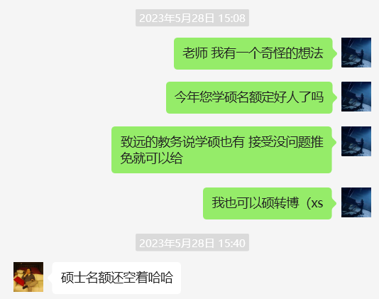
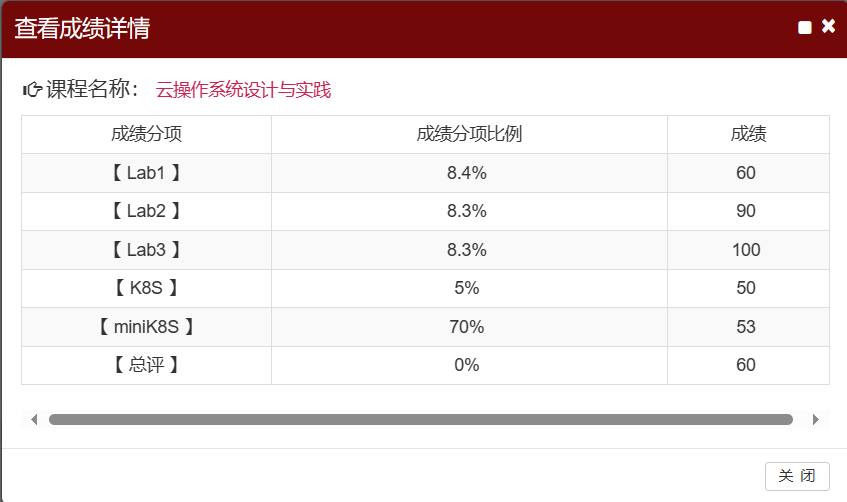
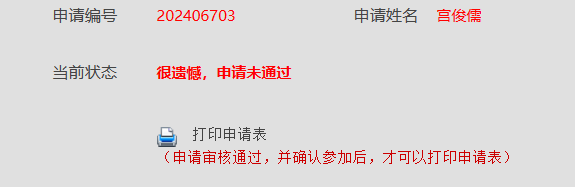
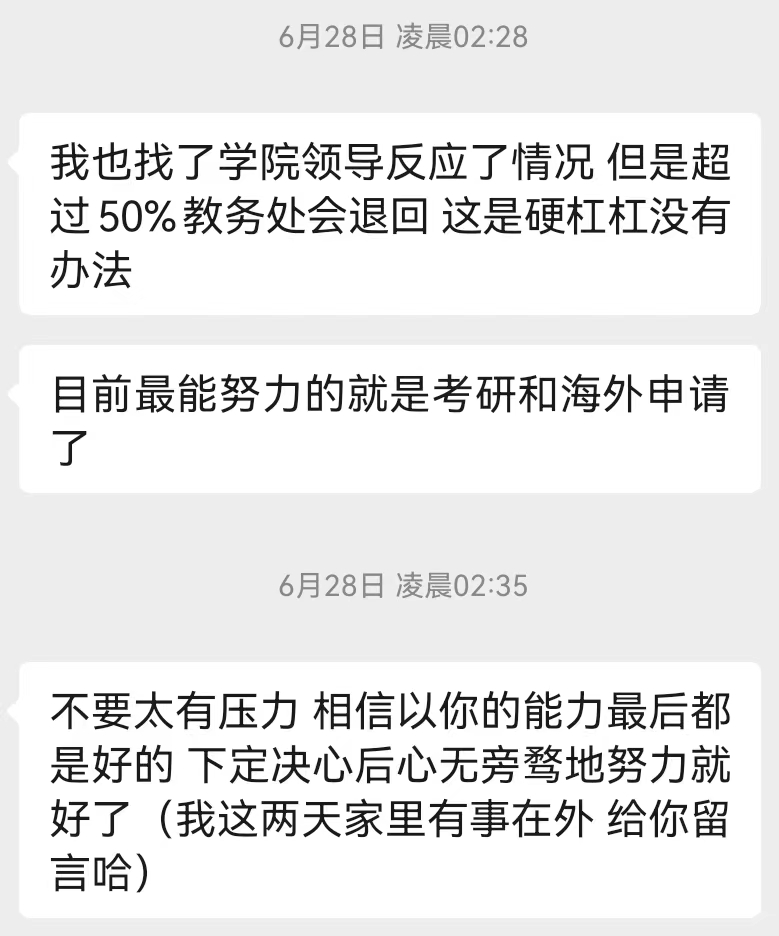
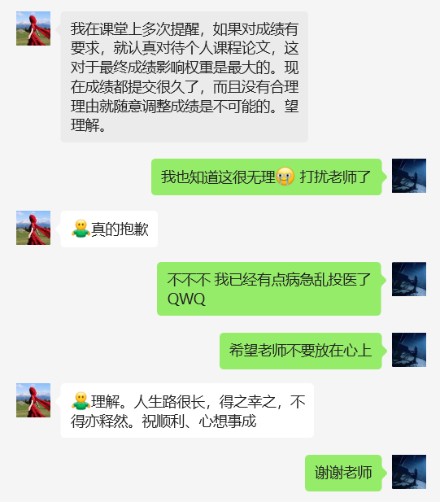
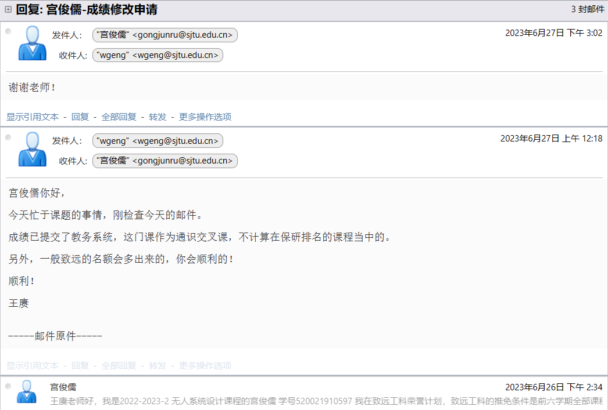
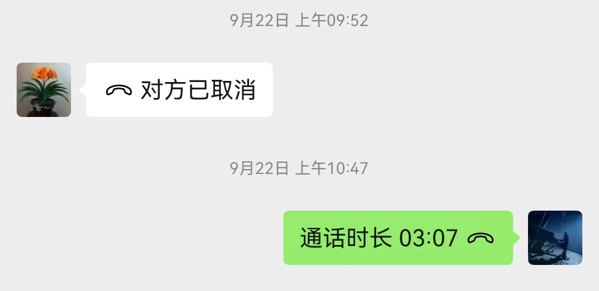
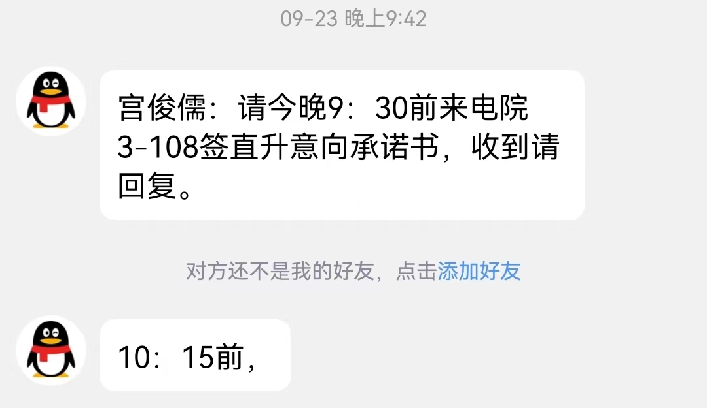
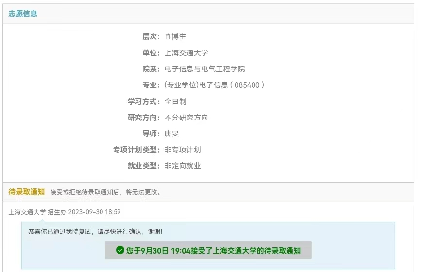
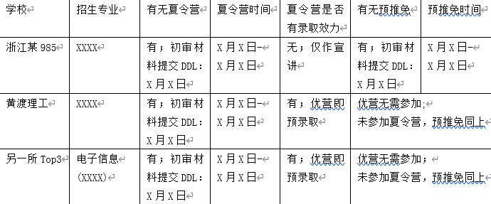

## 经历分享
### 写在前面：
在伟哥的思修课中，他会送给每个人一句话。

我收到的话是“希望你的极限操作越来越少”，因为我是从一个小镇硬考过来交大的。

所以伟哥看人是真的很准，这三个月里我充满了极限操作。

想了很久这篇文章要用什么体裁，如果是经验分享贴那应该更加正式一些。但最后还是决定在这篇里主要讲自己的经历，写自己最擅长的散文。

形散以写意，实凝以说理。
### 清澈的愚蠢
2020年入学时我与两位刚刚完成直博夏令营的机动学长特别熟悉，由于加入了致远工科，所以向他们请教了一些关于夏令营和保研的常识。

当时我对这件事的看法就是，推免完全看成绩，初审只是用来筛掉外校同学的，复试就走个过场。

三年过去，当我自己亲身面对这个过程时，才意识到自己的愚蠢，这三个月来我极度不顺利，几乎遍历了所有的可能性，在一切尘埃落定后，我决定把这些内容记录下来，近几年的朋友可以吸取经验教训，远几年的朋友可以看个乐子。

### rock bottom
正如大家都知道的，保研是一个双向的过程，从本科学院这边得到推免资格（推荐免试攻读研究生资格，相当于考研的初试通过）后，在任意单位得到一个接收offer（方式包括但不限于夏令营、预推免、九推，相当于考研的复试通过），保研就成功了。

六月份时我的情况是这样的：

推免这头，我成绩排在44%，可以得到致远工科的推免名额。

接收这头，我与CS的王韫博老师约定好了接收方式，他虽然没有博士名额，但我可以报名他的硕士，再转博，因此报名参加了CS的硕士夏令营。

随后我遇到了人生中最大的一次低谷经历，简单来说就是，我在一天之内得知：

推免这头，由于最后一学期组队失利，一个人承担了过多工作量，一门课成绩爆炸，GPA戏剧性的来到了51%（离进入50%差0.018分），失去了推免资格。

接收这头，也许是由于出了50%，我甚至没有通过CS的硕士夏令营简历筛。

消沉了几天后我开始了有生以来最疯狂的信息收集，想想还有什么办法让自己有书读。

好消息是，我最终有书读了。

坏消息是，这三个月的事情比较曲折。接下来的两个部分会分别解释我是如何解决推免和接收这两方面问题的。
### 推免——我误会了致远但生逢其时
致远工科有个小秘密（笑），就是所有人只要留到最后一定是可以拿到推免名额的。

由于我今年这一出好戏，以后也许这个小秘密就不存在了，所以我也敢把它讲出来了。

所以当我刚刚得知自己出了50%时，并没有十分把这件事放在心上，直到：

深夜发来的消息让我不得不重视这件事，我开始争取去改一改这学期的成绩，只要随便一门四学分的课多拿三分，就可以进入前50%了。

成绩提交后再进行修改是严重的教学事故，这个努力当然以失败告终了，当然在努力的过程中，有些老师的反应也让我感到慰藉。吴亚妮老师在拒绝我后进行了一些基本的同理与安慰；王赓老师更是直截了当的说致远每年的名额都会多出来，让我不用担心。

加上从几位学长那里得到的信息，我还是更愿意相信推免问题会随着时间流逝自然解决，只是致远在卡着我而已，直到我意识到了卡着我的真的不是致远。

九月初开学前夕，我收到了张媛媛老师的电话，说会帮我打个报告申请推免，那一刻我一度以为这个问题解决了。9月22日，我在包图二楼睡醒后，上午十点四十分，发现自己错过了张媛媛老师的电话，打回去得知我的推免申请在教务处那里没有审批通过。

但我在得知致远的推免审批没有通过的同一天，得知了今年电院的专项情况。专项的具体情况会在下面的接收模块中详细展开，这里就不多写了。这些专项会让学校今年的推免名额大幅膨胀。

一种希望灭绝了，但另一种希望开始了，我只能简单整理下自己，重新回到不确定性之中去。

所以一切都是真的，我在沙金锐学长的指点下，越过重重阻碍，通过绝对可靠的方式联系到了致远学院的一位领导，得知今年的情况就是要比往年特殊，他们开了很多次会，直到9月22号上午还在开会，打了一次又一次申请，但教务处就是不批。

今年的情况特殊在：
* 只有我一个人在50%外需要使用致远的这种特殊推免，为一群人开口子和为一个人开口子终究是不同的
* 今年由于各种专项门路大开，电院推免名额暴涨，各专业的推免基本都顺延到了50%-60%，真的在致远留下的边缘同学，值得致远打报告申请的同学（比如我这种）是一定可以在专业内自然获得推免的，因此特殊推免的审批就会受到阻碍

由于专项，电院大概多了160个推免名额，于是先把各专业都暴躁的推到了50%，然后像挤牙膏一样非常非常吝啬的继续发送推免。
经过了两天忐忑地等待后，我基本放弃了拿到推免的希望。

九月二十三号，我在心协开会的时候收到了陆瑾老师的一条滑稽的短信，她邀请我穿越到过去，前往电院3-108签字确认推免。

戏剧性的是，当时我们正在进行的活动是把自己的烦恼匿名写到小纸条上，每位同学随机抽取一张小纸条，念出这位同学的烦恼并提供一些建议。

我的小纸条写的是：

>我在经历了三个月的努力后（指下文在接收方进行的努力）保研失败了，准备下一站去工作两年润新加坡。真正的英雄主义就是要允许一切发生。

当天晚上我收到短信后激动的出门，和大家说我的小纸条作废了，顶着大雨往来电院一趟，还把手机的外屏摔碎了。

所以人的努力要结合历史的行程，我的推免问题以这种奇怪的方式解决了。这其实留给了我许多隐患，因为致远的推免比普通的推免更高贵，普通的推免比专项带来的推免更高贵，虽然专项的推免并没有限制接收方向。

只是我当时并没有意识到。
### 接收——公若不弃，布愿拜为义父
这三个月中让我最印象深刻的痛苦就是，我要在不知道自己有没有推免资格的情况下，去联系老师解决自己的接收问题。

这几乎是无法完成的工作，但我投入了难以想象的努力。吕布不过三姓家奴，我尝试了六个去向，得到过四位老师的明确offer。

#### 人工智能研究院 王韫博老师
于我而言，最好的接收方应该是王韫博老师，我已经和他认识了一年多，进组工作了半年多，十分希望留在组里。前面提过，王老师的博士名额被硕转博的师兄预定了，因此我需要先报名他的硕士。但当我没有入围CS的硕士夏令营后，事实上我能留在组里的概率就极小了，大概只有以下几种可能：
* 大老板在电子系也可以招生，等待电子系的九推硕士（可能性最大）
* 争取到大老板的博士名额，报名CS的九推博士或电子系的九推博士（可能性极小）
* 期待CS今年被鸽穿，九推招硕士（完全不可能）

最后，电子系的九推史无前例的没有招硕士，大老板的两个博士名额一个留给了其它老师组里的同学，另一个留给了另一个硕转博的师兄，我灰溜溜的离开了人工智能研究院。

离开前，王韫博老师为我提供了另一条可能的出路：
#### 清华戴琼海组 陈一彤老师
八月中旬，在科大讯飞出差的时候偶然收到了王老师的电话，陈老师预计会入职交大，今年要提前招一个博士生，他就把我的简历推了过去。

陈老师的研究方向是光电计算，初步电话交流后相谈甚欢，尽管在当时那个时间点我依然无法确认自己有没有推免资格，但我轻松通过了陈老师的初筛，甚至加了微信（bushi。

接下来的工作是读一些光电计算的工作（三篇nature子刊一篇science子刊，其中两篇工作是戴院士组里的）完成一个paper review，我由于心态过于放松，更新了一篇博客交了过去，让陈老师非常惊讶，因为其他同学上交的格式都相当的正式。她表示很有趣，而且觉得内容也过关，所以邀请我进入最终的面试环节。

面试时我们交流着发现，陈老师还是希望招到有硬件背景的同学去工作，而我完全是软件方向的工作者，对电子硬件略懂一点，对光学硬件一窍不通。因此虽然相处的很愉快，但我没有拿到她的博士名额。

#### 留在软院也不错
没想到吧，软件工程专业的几乎所有硕士都在九月招生，我在上面的一系列折腾后，依然可以报名本专业的九推，和本专业的大多数同学走在了同一条起跑线上。

这里补充一个小知识，一般的学院是六七月份举办夏令营，九月份举办预推免，十月份举办九推，这三个活动的地位完全等价，就是提供接收方的offer。但电院由于比较热门，惯例是十月份不会举办九推，九月份就是最后的机会，所以有时候人们会把电院九月份的预推免工作叫九推。

在入围阶段略有波折，大家应该也知道今年软院的搞笑行径，第一批只放了极少的人进入九推，随后在得知专项扩展了名额后又放了一批名额进来，我就属于那种被先发了拒绝邮件又发了通过邮件的同学。

当时我被拒绝的原因是，软院只想放核心学积分前30%和在致远且50%以内的同学，我当时略微意识到了事情的发展可能不对，不在致远前50%的同学（其实也就是只有我）好像是没有“致远权”的。就算能拿到推免，专业里好像也不是很想要。

果然，当我顺利完成了笔试，三小时敲了450行，完成了90%的内容后，在面试时被臧院长当面明确告知，他们不会要我。我在并未得知自己笔试面试成绩的情况下被告知九推不通过，这甚至让我无法把面试成绩转成其他专业的直博成绩，直接堵死了我在九推中拿到offer的可能。

事后我得知，往年100%录取的软院九推今年也发生了巨大变化，软院今年的九推中offer接收极少。硕士入围31人，但不算专项本专业只能接收19个同学，两个专项的硕士全部不允许其他专业同学报名后，增加到了25个。于是我接受了自己留不在软院的事实，开始关注后续的专项招生。

#### 中组部专项 张江实验室
9月22日，12：30在软院演播厅，电院紧急开会，郁美娟老师宣布了今年学校的两个专项计划：

中组部专项：也就是去年大火的工程硕博，今年大招特招，硕士70+ 博士40+；
集成电路专项：在中组部专项招生后招生。

关于两个专项的细节大家可以关注水源社区，我在这里不多做阐述，这两个专项意味着今年全校的推免名额势必大幅扩张，给我提供了新的希望，事实上也的确是这样的。

我在中组部专项中报名了张江实验室，因为他们与致远的合作关系十分密切，在报名截止的四小时前我才开始联系他们，但由于机缘巧合做过光电，以及致远工科的光环，报名截止的两小时前就已经找到了做光电的老师双向确认，而且并不担心他们会鸽我，但这个时候搞笑的事就发生了。

中组部专项要求录取的学生必须排在“前50%”，这是一个显然一拍脑袋定下来的，并不科学客观的门槛，导致很多时候往往是学生想去，企业想要，但是没有办法走通这条路。比如我就被拒之门外。

讲个轶闻，这个门槛一开始是30%，郁美娟老师苦口婆心地打报告后才变成了50%。大家可以想象一下如果这个门槛是30%会发生多诙谐的事。我也不妨把话说得更明白一些，交大电院前30%的人不可能在这个专项开始招生时依然没有接收方offer。

电院在纠缠后最终保持了这条底线，但没有完全保持。

它把大多数在50%以外甚至刚刚好排到50%的同学拒之门外，这导致了许多中组部专项今年都没有招满（信源：张江实验室），道理其实是很简单的：

本校50%以内又没有去向愿意来这个专项的人很少，外校过来的人老师们和企业又不想要。

信息安全专业由于招生人数12，本校报名10人，外校报名6人，就适当放宽了50%的限制。

但由于一切都是黑盒，交大电院至今没有留下任何与第一批专项招生（后续发送的招生通知是第一批没有录满的部分名额）有关的文件，28号左右所有中组部第一批专项录取结束，第二批补录开始时我已经尘埃落定，因此没有打听信息。

是非功过付之一炬。
#### 中科院高等研究所 魏建明老师
得知中组部工程硕博专项依然不靠谱时，我的精神几乎已经崩溃了。

在我的朋友cy的推荐下，我报名了唯一一个仍然还在招生的、上海的中科院所。

这个所的水准与西交、哈工大差不多，我面试后拿到了电子信息方向的复试第一名，魏建明老师主动联系我抛来了橄榄枝。

魏老师是强化学习方向的，仍然保持着学术品位的优秀学者，对我很感兴趣不吝盛赞许以培养，简直就是大饼加大饼。

但我在他与我联系的同时接到了另一位老师的回复，与另一位老师当面交流后确定了自己可以接受集成电路专项计划，为了不影响中科院高研所的后续工作，我在28日晚上，也就是系统开放前一天放弃了高研所的offer。

让我重点介绍一下我最后的去处，以及最后这位老师是何等一位妙人儿。

#### 集成电路专项 唐旻老师
这是我的朋友的老板，在电子系做EDA（electronic design automation），简单来说就是集成电路的仿真软件。

联系后发现他需要一位工程代码能力很强的同学来维护软件，且需要一位有AI背景的同学来做一些Ai4Science的工作。我不敢相信我还可以留在本校深造，并几乎不改变自己的研究方向。

缘分确实就是这么奇妙，我同时满足这两点，所以很受老师欢迎，当天下午就聊好了接收，唐老师甚至允许我读这种专项博士后可以不去企业里工作。

加上之前收到了一些消息，集成电路专项几乎是差额录取，报名的人还没有接收数量多，把我整膨胀了，完全没准备它的面试。

我在9月29日当天因为一些原因自我界限完全失守，一直到这篇博客写完都没有完全修复。

一晚只睡了三个多小时，第二天七点爬起来十分憔悴地赶工做了个PPT，在第二天上午10：30十分憔悴地面试，好在最终顺利通过。

事后和唐老师交流时他说，面试时有一位外校211的CS专业同学十分优秀，面试准备相当充分，简历极度丰富（211第一特有的啥啥都强，学积分高、项目丰富、论文也多、社会实践充足、科研意愿强烈），PPT十分精美（唐老师还把她的PPT发给了我），我那垃圾PPT和堪比弥留阶段的精神状态相比起来简直就是笑话一样。如果不是前一天和我聊好了，他都留不住我，难以想象我让他丢了多少面子（bushi，这样显得他眼光真的很差。

但最后一方面我的面试表现较好，唐老师提出的问题大多是我们前一天聊到过的内容，因此对答如流。以及我这段时间发现自己的英语口语没有自己想象的那么烂，好像还是会说英语的（笑）。再加上毕竟还是聊好了接收，唐老师还是很郁闷的把我招进了组。

这就是这个世界运转的方式吧，我并没有看不起这些外校的优秀同学，事情要比这来得更不幸，我根本看不见他们，完全没有防范过。

好在最后也确实没有被影响到，但我也许不会一直这么幸运。

噢，唐老师顺便勒令我更改一下精神面貌，抓紧去理发（笑）。

so finally：

### 我的感受
#### 不确定性
在巨大的不确定性中保持努力需要莫大的勇气，因为这种努力随时有可能落空。许多时候我都不知道自己有没有推免，但是在为接收端的事情努力，这种努力随时可能像竹篮打水一样。

我在这三个月的过程中发现自己变得远比三年前懦弱，十分抗拒这种随时会落空的努力，于是刚刚开始振作起来时十分的痛苦颓丧。我大概胖了五斤，黑了一些，还把头发留长了。

时至今日我又开始想说一些幸存者才能说的话了。

大一的时候看到佳东哥的朋友圈，说人生就是选好一个目标之后朝那边走一段时间，把一路上的风景记录下来就可以博士毕业，保持一段时间后就会成为别人眼中的人生赢家。

我想这是一个相当乐观的描述，这三个月给我带来的感受与之类似，但我更愿意将其描述为：

人生就是选好一个目标之后朝那边走一段时间，只要活得够久，有足够的容错率让自己失败后可以爬起来，就早晚能等到成功的那天。三个月以来我只顺利过两次，一次是专业里递补到推免，一次是提前一天联系了唐老师占好了位子。
#### 向外归因
在得知自己没有拿到推免，需要继续等待专项，并慢慢失去希望时，我的第一反应其实是工作两年后润新加坡。

因为我在这一系列层次丰富，内容充实，花样百出的负反馈中并没有质疑自己的能力，我把这段时间称之为有期徒刑九十天就是因为，这九十天的经历对我的能力几乎没有提升，事实上我时至今日依然认为这一系列的不顺利更多的是政策的问题，我坚持向外归因。

把不顺利的事情向外归因，认为他们是暂时的，是客观原因造成的；而不是永久存在的，不是自己主观的原因造成的，这样可以保护我的自我评价。

如果我觉得自己的确配不上留在这里，也许我真的就不会留在这里了。
## 经验分享
>这一部分是我的一位不愿意透露姓名的朋友写滴 干货比较多

匿名朋友BG

专业：电院非幻神专业

保研去向：本校本系直升学硕

经历省流版：预推免阶段海投华五+中科院某所，过初审；未参与除交大外的复试（部分因与交复试时间冲撞，部分因复试时间晚于交大出结果遂鸽之）

以下经验主要供意向为直升【硕士】的学弟学妹参考，因本人视野的局限且不同年份不同专业可能会存在显著差异的原因，本人对以下观点的普适性不负任何责任（bushi）。免责声明结束，正文开始：

### 交大电院预推免

由于笔者本人无直博意向，同时也了解自身能力无法保研Top2的硕士，故本校本系无疑是最优解，因此耗时最多为之准备。关于预推免考核内容各专业不尽相似，正所谓隔行如隔山，所以建议大家多多向本专业老师和往届学长学姐打听……笔者主要是想谈一下关于【前三年专业排名】和【联系导师】在【硕士】直升的作用。据身边统计学观察，一般分为以下三种情况：

①	预推免排名近似前三年专业排名，约占80%；

②	预推免超常发挥，约占10%；

以上两种都属于可喜可贺，但此文写作的目的主要是想提醒大家避免以下情况的发生：

③	预推免排名远低于前三年专业排名，约占10%。

首先此时会有两种结果：

第一种是排名较低但仍被录取，只是在硕士的专业细分方向选择上比较受限；

第二种更严重的是排名过低不被专业录取，由于预推免结果公布已近九月底，假如未有其他保底Offer（这也是本文第二部分写作的原因），则相当于获得推免资格但无接收单位，保研失败。同时由于推免资格已公示，根据学校规则原则上不得在大四阶段办理出国材料和参加就业派遣。

其实这类同学前三年的专业排名往往在一众保研同学中也相对靠前，在大三阶段也联系了意向专业的导师参加项目，因此可能反而对预推免的考试放松了警惕。但以笔者专业为例，预推免分为笔试100分和面试100分，前三年的成绩仅在面试成绩构成中占比10%-20%（作为对比，英语问答考核占比约40%）。另外，与选择【直博】不同，导师在【直研】预推免考核中实际上话语权极少。暂且不论每一年只有一到两个接收名额的老师是否会存在同时联系接触了好几个同学的海王行为，哪怕学生与导师双向奔赴山盟海誓，但假如学生预推免考砸了，导师也没有任何权力更改预推免考核的分数。

当然这并非不建议大家前三年保持优秀的专业排名以及积极联系导师，但希望学弟学妹们能对这两者在预推免中的作用有更清晰的认知：前三年的优秀排名意味着对专业知识更好的掌握，有助于笔试的发挥，但也不能忽略考前有规划的复习和必要的应试技巧；联系导师是为了拥有更多的项目经历在面试中展现，但绝不能抱着“我导师都找好了，预推免肯定稳了”的心态。

### 关于保底Offer

对2020级的保研er来讲，保底Offer主要有三：一是外校非Top2的接收（华五非交同学别看，是恶评），二是工程硕博，三是集成电路专项。
	外校offer获取途径主要有两种：一是夏令营，二是预推免。报名和选拔流程与交大其实大同小异，成为一名多线并行的海王保研er最重要的是合理管理鱼塘梳理信息，必要时可拉表以便观看，比如：

实际上各校的夏令营/预推免考核内容基本相同（只要报的是相类似专业），所以相当于复习一遍的内容考多次。实际操作过程中最大的问题可能是时间冲突，那这就看大家自己的取舍了。

## 致谢
感谢出现在这篇文章里的我的朋友们为我提供各种经验、并为我提供心理支持。

感谢**陈垍铮**拉我一起做机考题保持状态，并在我陷入低谷后感同身受地陪伴我度过六七月最艰难的那段时间。

感谢**工程力学强基圈子的几位朋友们**带我维持着基本作息，让我没有时间绝望。

感谢**张驰**带我认识他的老板，这是一位难得的妙人儿。

感谢**也许不愿意透露姓名的几位朋友**与我从未间断的交流，毁灭焦虑的最好办法就是收集足够的信息，然后允许一切发生。

感谢**陶青筱学姐**分享的软院经验，感谢我的学长兼朋友**王兴宸、曹树、沙金锐**让我相信前面也不是一片漆黑，天亮了就会好的。

感谢**吉林招生办刘讯飞老师**帮我联系致远学院的领导让我真正相信不是致远为难我，而是真的批不下来。

感谢**张媛媛老师**不厌其烦的在职责范围内外都尽了最大的努力陪我胡闹。

感谢**郁美娟老师、陆瑾老师、马菁老师**提前向我透露的各种信息，极大程度的减轻了我的焦虑，让我做出了还算让自己满意的选择。

感谢**王韫博老师**为了让我有更好的出路而花费的时间、精力与资源。

感谢**唐旻老师**收留我（笑），让我奇迹般地继续了Ai4Science的研究。

以及最后，感谢**我**自己始终没有放弃自己。
我这个人对自己的生命向来十分漠视，但这三个月的经历让我意识到了自己并不会因为生活的不顺利而有轻生的想法。

**我的骄傲不允许自己像一条败犬一样离开。**

最后想用阮晓寰先生转发过的一段话作为这篇博客的结尾，我认为这是我收获的最珍贵的经验。

>越战时，美国海军中将斯托克代尔（当时军阶为海军中校）被俘，关押于河内希尔顿战俘营，直到八年后获释。归国后，他的事迹被广为宣传，管理学家柯林斯（Jim Collins）就曾慕名拜访过他。在访谈中，柯林斯注意到一个有趣的现象：战俘营里的其他战俘，大多比斯托克代尔年轻，身体状态也好得多，却大批死亡。
>
>于是柯林斯好奇地问：“八年时间，你有很多同伴不幸遇难，为何你能熬过来？”斯托克代尔略加思索：“我一直渴望活着出来见家人，这个愿望一直支撑着我。”吉姆不解地问：“那些死去的人，应该也和你一样啊？”
>
>斯托克代尔遗憾地答：“他们要么过于悲观，要么过于乐观。悲观者被焦虑打败，而那些乐观者总盼望圣诞节就可被特赦，可是节日过后没能如愿，于是又想复活节可以，结果还没被释放。这样失望复失望，失望就变成了绝望。”
>
>最后，斯托克代尔总结说：这是一个非常重要的教训——你不能把信念和原则搞混。信念是：你一定能获得成功，这个信念千万不能失去。原则是：与此同时，你一定要面对最残酷的现实.
